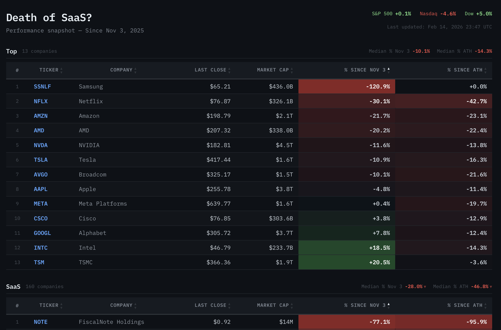
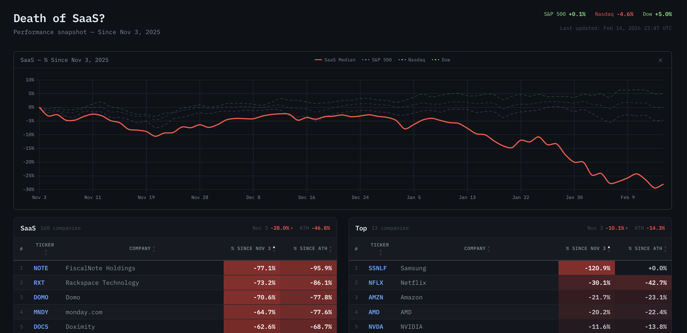

# SaaS Ticker Dashboard

A dashboard that tracks SaaS company stock prices and shows how they're doing since Nov 3, 2025. Displays last close, market cap, % change since Nov 3, and % change since all-time high in a heatmap-styled table. Nov 3 is a somewhat arbitrary date chosen to see if the so called death of SaaS is real or not.

Built with FastAPI, yfinance, SQLite, and Jinja2 using OpenCode. Prices are fetched on demand or automatically at 6 PM Mon-Fri via APScheduler.

## Getting started

Build and run with Docker:

```
docker build -t sass-ticker .
docker run -d --name sass-ticker --restart unless-stopped -p 8000:8000 -v sass-ticker-data:/app/data sass-ticker
```

Open the dashboard and click "Refresh Data" to fetch prices:

- Docker Desktop: http://localhost:8000
- OrbStack: https://sass-ticker.orb.local

To run locally without Docker:

```
uv sync
uv run uvicorn main:app --reload --port 8000
```

## Screenshots




